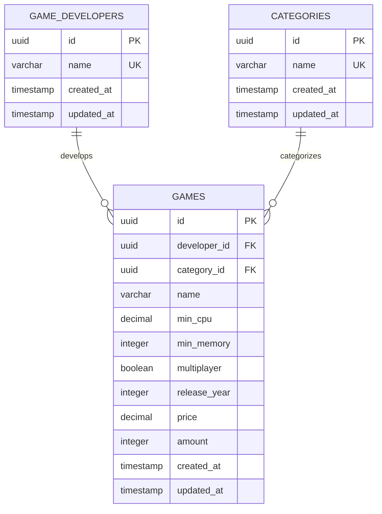

# TU Varna GameDev Catalogue

> A comprehensive game development catalogue management system built as a course project for Technical University of Varna

## About

This is a full-stack web application for managing a catalogue of game developers, games and categories The project demonstrates modern web development practices using NestJS for the backend, Next.js for the frontend, and PostgreSQL for data persistence.

## Features

- **Game Developer Management**: Create, read, update, and delete game development companies
- **Game Catalogue**: Comprehensive game database with metadata (title, release year, publisher)
- **Category System**: Organize games by genres (RPG, Action-Adventure, Shooter, etc.)
- **Inventory Tracking**: Manage stock levels and pricing for each game
- **RESTful API**: Well-documented API with Swagger/OpenAPI support
- **Database Migrations**: Version-controlled database schema changes with TypeORM
- **Seed Data**: Pre-populated database with 30+ games from major developers
- **Modern UI**: Responsive interface built with React 19 and Tailwind CSS
- **Type Safety**: Full TypeScript implementation across frontend and backend

## Tech Stack

### Backend
- **Framework**: NestJS 11 with Fastify
- **Database**: PostgreSQL 16
- **ORM**: TypeORM
- **Validation**: TypeBox schemas
- **API Documentation**: Swagger/OpenAPI

### Frontend
- **Framework**: Next.js 15 with React 19
- **Styling**: Tailwind CSS 4
- **UI Components**: Radix UI primitives
- **Icons**: Lucide React

### Development
- **Language**: TypeScript 5
- **Package Manager**: pnpm 8
- **Testing**: Jest
- **Code Quality**: ESLint, Prettier
- **Containerization**: Docker & Docker Compose

## Prerequisites

- **Node.js** >= 18.0.0
- **pnpm** >= 8.0.0
- **Docker** (for local database)

## Quick Start

### 1. Clone the Repository

```bash
git clone git@github.com:mifkata/tu-varna-gamedev-catalogue.git
cd tu-varna-gamedev-catalogue
```

### 2. Install Dependencies

```bash
pnpm install
```

### 3. Configure Environment

Copy the example environment file and configure it:

```bash
cp .env.example .env
```

Edit `.env` as needed. Default values work for local development.

### 4. Start Database

Start PostgreSQL and pgAdmin using Docker Compose:

```bash
docker compose up -d
```

This starts:
- **PostgreSQL** on port `5432`
- **pgAdmin** on port `5050` (http://localhost:5050)

### 5. Run Migrations

Apply database migrations:

```bash
pnpm migration:run
```

### 6. Seed Database (Optional)

Populate the database with sample data:

```bash
pnpm seed
```

This seeds the database with realistic game catalogue data including:
- **10 Game Developers**: CD Projekt Red, Rockstar Games, Valve, FromSoftware, Bethesda, Nintendo, Blizzard, Ubisoft, EA, Naughty Dog
- **9 Categories**: RPG, Action-Adventure, Shooter, Souls-like, Open World, Puzzle, MOBA, Strategy, Sports
- **30 Games**: Including classics like Half-Life (1998) and modern titles like Elden Ring (2022)
- **Inventory Records**: With realistic pricing in EUR and stock levels

### 7. Start Development Server

```bash
pnpm start:dev
```

The application will be available at:
- **Backend API**: http://localhost:3000/api
- **API Documentation**: http://localhost:3000/api/docs (Swagger UI)
- **Frontend**: http://localhost:3000

## Documentation

For detailed project documentation including architecture, database schema, and API specifications, see:
- [Project Documentation (PDF)](./DOCUMENTATION.pdf)
- [Detailed Documentation](./documentation/README.md) (Bulgarian)

### Database Schema



### API Endpoints

The application provides RESTful APIs for:
- **Game Developers** (`/api/game-developers`)
- **Games** (`/api/games`)
- **Categories** (`/api/categories`)
- **Health Check** (`/api/health`)

For complete API documentation with request/response examples, visit the Swagger UI at http://localhost:3000/api/docs when the application is running.

## Available Commands

### Development

| Command | Description |
|---------|-------------|
| `pnpm start:dev` | Start backend in watch mode with hot reload |
| `pnpm start:debug` | Start backend in debug mode with watch |
| `pnpm start` | Start backend (no watch mode) |

### Production

| Command | Description |
|---------|-------------|
| `pnpm build` | Build both backend and frontend for production |
| `pnpm build:backend` | Build only backend (TypeScript compilation) |
| `pnpm build:frontend` | Build only frontend (Next.js build) |
| `pnpm start:prod` | Start production server from `dist/` |

### Database Migrations

| Command | Description |
|---------|-------------|
| `pnpm migration:generate <name>` | Generate a new migration based on entity changes |
| `pnpm migration:run` | Run pending migrations |
| `pnpm migration:revert` | Revert the last migration |
| `pnpm migration:status` | Show migration status |
| `pnpm seed` | Populate database with sample game catalogue data |

**Example:**
```bash
pnpm migration:generate migrations/AddUserTable
```

**Note on seeding:** The `pnpm seed` command will clear existing data and populate the database with 30 games from 10 major developers, along with categories and inventory records. Use this for development and testing purposes only.

### Testing

| Command | Description |
|---------|-------------|
| `pnpm test` | Run all tests |
| `pnpm test:watch` | Run tests in watch mode |
| `pnpm test:cover` | Run tests with coverage report |

### Code Quality

| Command | Description |
|---------|-------------|
| `pnpm lint` | Run ESLint and Prettier checks |
| `pnpm lint:fix` | Auto-fix linting and formatting issues |
| `pnpm eslint:lint` | Run ESLint only |
| `pnpm eslint:fix` | Auto-fix ESLint issues |
| `pnpm prettier:lint` | Check code formatting |
| `pnpm prettier:fix` | Auto-format code |

## Project Structure

```
.
├── backend/
│   ├── entities/          # TypeORM database entities
│   ├── controllers/       # API route controllers
│   ├── schemas/           # TypeBox validation schemas
│   ├── seeds/             # Database seed files
│   ├── decorators/        # Custom decorators
│   └── main.ts            # Application entry point
├── frontend/
│   ├── app/               # Next.js app directory
│   ├── components/        # React components
│   └── lib/               # Utility functions
├── config/                # Configuration files (see config/README.md)
├── migrations/            # TypeORM database migrations
├── documentation/         # Detailed project documentation (Bulgarian)
├── dist/                  # Compiled production files
├── .data/                 # Docker volume for PostgreSQL data
├── docker compose.yml     # Docker services configuration
└── DOCUMENTATION.pdf      # Complete project documentation
```

## Configuration

Configuration is managed using the [config npm package](https://www.npmjs.com/package/config) with TypeScript files.

Environment-specific configs are defined in the [config directory](./config/). For detailed configuration documentation, see [config/README.md](./config/README.md).

## Database Access

### pgAdmin

Access pgAdmin at http://localhost:5050

**Default credentials:**
- Email: `admin@admin.com`
- Password: `admin`

**Add PostgreSQL server in pgAdmin:**
1. Right-click "Servers" → "Register" → "Server"
2. **General** tab: Name = `Local GameDev DB`
3. **Connection** tab:
   - Host: `postgres` (or `localhost` if connecting from host machine)
   - Port: `5432`
   - Database: `gamedev_catalogue`
   - Username: `postgres`
   - Password: `postgres`

### Direct PostgreSQL Connection

```bash
# Using psql (if installed locally)
psql -h localhost -p 5432 -U postgres -d gamedev_catalogue

# Using Docker
docker exec -it gamedev_postgres psql -U postgres -d gamedev_catalogue
```

## Troubleshooting

### Port Already in Use

If port 3000 or 5432 is already in use:

```bash
# Change PORT in .env
PORT=3001

# Or change DB_PORT in .env and docker compose.yml
DB_PORT=5433
```

### Database Connection Failed

**Check if PostgreSQL is running:**
```bash
docker compose ps
```

**Restart database:**
```bash
docker compose restart postgres
```

**View database logs:**
```bash
docker compose logs postgres
```

### Migration Errors

**Reset database (⚠️ destroys all data):**
```bash
docker compose down -v
docker compose up -d
pnpm migration:run
pnpm seed  # Optional: reseed with sample data
```

**Check migration status:**
```bash
pnpm migration:status
```

### Module Not Found

**Clear cache and reinstall:**
```bash
rm -rf node_modules dist
pnpm install
```

### TypeScript Errors

**Rebuild project:**
```bash
pnpm build:backend
```

### Test Failures

**Clear test cache:**
```bash
pnpm test --clearCache
```

### pnpm Issues

**Check pnpm version:**
```bash
pnpm --version
# Should be >= 8.0.0
```

**Update pnpm:**
```bash
npm install -g pnpm@latest
```

## License

This project is created for educational purposes as a course assignment for the Technical University of Varna. It is provided as-is without any specific license restrictions.