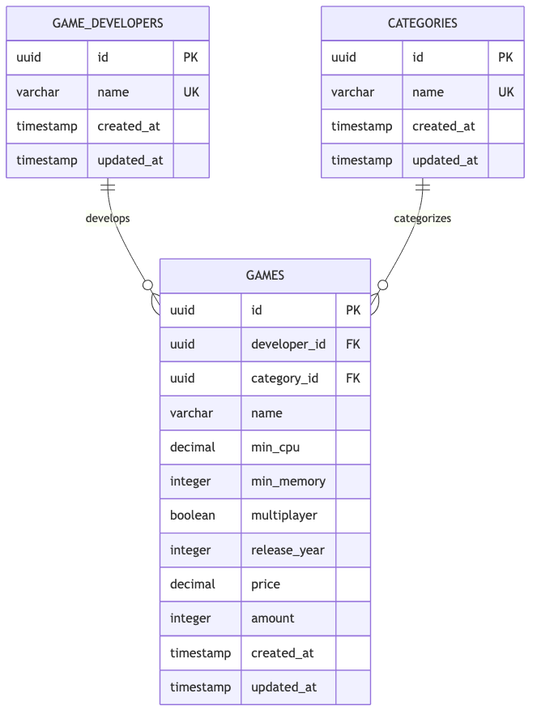
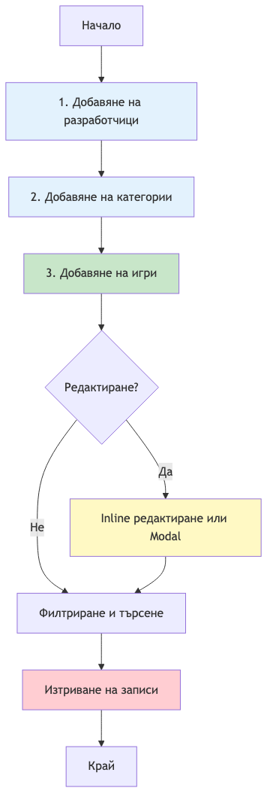

# GameDev Каталог - Описание на проекта

* **Вариант за курсов проект**: 18
* **Изготвил**: Андриян Александров Иванов
* **Специалност**: КСТ (задочно), 3ти курс
* **Факултетен номер**: 23623450

## Съдържание
- [Quick Start](#quick-start)
- [Описание на проекта](#описание-на-проекта)
- [Технологичен стек](#технологичен-стек)
- [Архитектура](#архитектура)
- [Подготовка на средата](#подготовка-на-средата)
- [Пускане на приложението](#пускане-на-приложението)
- [Работа с базата данни](#работа-с-базата-данни)
- [Структура на базата данни](#структура-на-базата-данни)
- [Документация за употреба](#документация-за-употреба)
- [REST API](#rest-api)

---

## Quick Start

Бързо стартиране на проекта в режим за разработка:

```bash
# 1. Разархивиране
unzip tu-varna-gamedev-catalogue.zip
cd tu-varna-gamedev-catalogue

# 2. Инсталиране на dependencies
pnpm install

# 3. Конфигурация
cp .env.example .env

# 4. Стартиране на базата данни
docker-compose up -d

# 5. Пускане на миграции
pnpm migration:run

# 6. Зареждане на примерни данни
# Незадължително, изтрива всички данни в базата!
pnpm seed

# 7. Стартиране на приложението
pnpm start:dev
```

**Отворете браузър на:**
- Приложение: http://localhost:3000
- API документация: http://localhost:3000/api/docs
- pgAdmin (уеб базиран клиент за бази данни): http://localhost:5050

---

## Описание на проекта (Вариант 18)

**GameDev Каталог** е уеб приложение за управление на списък с разработчици с видео игри и техните продукти, разпределени в множество категории. Проектът е разработен като **изпитен проект по ООП2 в ТУ-Варна** и представлява пълнофункционално full-stack приложение използващо модерни библиотеки.

### Основни функционалности:
- 📋 Управление на разработчици на игри
- 🎮 Управление на видео игри с подробна информация
- 🏷️ Категоризация на игрите
- 🔍 Филтриране и сортиране на данни
- ✏️ CRUD операции за всички ентитети
- 🗑️ Масово изтриване на записи
- 📝 Inline редактиране на данни

---

## Използвани технологии

### Backend
- **NestJS** - Node.js web framework за изграждане на ефективни и скалируеми сървърни приложения
- **Fastify** - Бърз и нискоресурсен уеб сървър
- **TypeScript** - Типизиран JavaScript
- **TypeORM** - ORM за TypeScript и JavaScript (ES7+)
- **PostgreSQL** - Релационна база данни
- **Jest** - Testing framework с code coverage

### Frontend
- **Next.js 15** - React framework с App Router
- **React 18** - Библиотека за изграждане на потребителски интерфейси
- **TypeScript** - Типизиран JavaScript
- **Tailwind CSS** - Utility-first CSS framework
- **Radix UI** - Unstyled, accessible UI компоненти

### Инструменти
- **pnpm** - Бърз, ефективен менаджер за Node.js пакети
- **ESLint** - Инструмент за валидация и стилистика на кода
- **Prettier** - Инструмент за форматиране на кода

---

## Архитектура

Приложението е изградено като **монолит** (backend и frontend се стартират като едно приложение) със следната структура:

```
tu-varna-gamedev-catalogue/
├── backend/              # NestJS приложение
│   ├── controllers/      # REST API контролери
│   ├── entities/         # TypeORM ентитети
│   ├── schemas/          # Validation schemas
│   ├── services/         # Бизнес логика
│   ├── seeds/            # Database seeding
│   └── main.ts          # Entry point
├── frontend/             # Next.js приложение
│   ├── app/             # App Router pages
│   ├── components/      # React компоненти
│   └── lib/             # Utilities и API клиенти
├── migrations/          # TypeORM миграции
└── package.json         # Root package.json
```

Проектът използва **monorepository подход** където `backend` и `frontend` споделят `dependencies` и са част от един проект.

---

## Подготовка на средата

### Изисквания
- **Node.js** >= 18.x
- **pnpm** >= 8.x
- **Docker** и **Docker Compose** (за PostgreSQL и pgAdmin)

### 1. Разархивиране на проекта
```bash
# Разархивирайте получения ZIP файл
unzip tu-varna-gamedev-catalogue.zip
cd tu-varna-gamedev-catalogue
```

### 2. Инсталиране на dependencies
```bash
pnpm install
```

### 3. Конфигурация на средата

Копирайте `.env.example` към `.env`:

```bash
cp .env.example .env
```

Файлът `.env` вече съдържа необходимата конфигурация за development режим:

```env
# Application
NODE_ENV=development
PORT=3000

# Database
DB_HOST=localhost
DB_PORT=5432
DB_USERNAME=postgres
DB_PASSWORD=postgres
DB_DATABASE=gamedev_catalogue

# pgAdmin (за docker-compose)
PGADMIN_EMAIL=admin@admin.com
PGADMIN_PASSWORD=admin
```

### 4. Стартиране на базата данни с Docker Compose

Проектът използва Docker Compose за лесно стартиране на PostgreSQL и pgAdmin:

```bash
docker-compose up -d
```

Това ще стартира:
- **PostgreSQL** на порт `5432`
- **pgAdmin** на порт `5050` (достъпен на http://localhost:5050)

**pgAdmin credentials:**
- Email: `admin@admin.com`
- Password: `admin`

За спиране на услугите:
```bash
docker-compose down
```

### 5. Пускане на миграциите

След стартиране на базата данни, изпълнете миграциите:

```bash
pnpm migration:run
```

### 6. (Опционално) Зареждане на примерни данни

За да заредите примерни данни в базата:

```bash
pnpm seed
```

---

## Пускане на приложението

### Development режим

Стартиране на backend в development режим:
```bash
pnpm start:dev
```

Backend ще бъде достъпен на `http://localhost:3000`

**Забележка:** Приложението е изградено като монолит - backend и frontend са част от едно цяло и се обслужват от същия сървър на порт 3000.

### Production build

```bash
# Build на цялото приложение (backend + frontend)
pnpm build

# Стартиране на production build
pnpm start:prod
```

### Testing

```bash
# Пускане на тестове
pnpm test

# Тестове в watch режим
pnpm test:watch

# Тестове с coverage
pnpm test:cover
```

### Linting

```bash
# Проверка с ESLint и Prettier
pnpm lint

# Автоматично поправяне с ESLint и Prettier
pnpm lint:fix

# Само Prettier форматиране
pnpm prettier:fix

# Само ESLint проверка
pnpm eslint:lint
```

---

## Работа с базата данни

### Миграции

#### Създаване на нова миграция
```bash
pnpm migration:generate migrations/MigrationName
```

#### Пускане на миграции
```bash
pnpm migration:run
```

#### Отмяна на последната миграция
```bash
pnpm migration:revert
```

#### Показване на статуса на миграциите
```bash
pnpm migration:status
```

### Seeding

Зареждане на примерни данни в базата:
```bash
pnpm seed
```

---

## Структура на базата данни

Базата данни се състои от три основни таблици с релации:



### Описание на таблиците

#### `game_developers`
Съхранява информация за разработчиците на игри.
- **id**: Уникален идентификатор (UUID)
- **name**: Име на разработчика (уникално)
- **created_at**: Дата на създаване
- **updated_at**: Дата на последна промяна

#### `categories`
Съхранява категориите на игрите (напр. Action, RPG, Strategy).
- **id**: Уникален идентификатор (UUID)
- **name**: Име на категорията (уникално)
- **created_at**: Дата на създаване
- **updated_at**: Дата на последна промяна

#### `games`
Основна таблица с информация за игрите.
- **id**: Уникален идентификатор (UUID)
- **developer_id**: Връзка към разработчик (задължителна)
- **category_id**: Връзка към категория (задължителна)
- **name**: Име на играта
- **min_cpu**: Минимален CPU (GHz)
- **min_memory**: Минимална RAM памет (MB)
- **multiplayer**: Поддръжка на мултиплейър
- **release_year**: Година на издаване
- **price**: Цена (в долари)
- **amount**: Налични копия
- **created_at**: Дата на създаване
- **updated_at**: Дата на последна промяна

### Релации и ограничения

1. **Уникална комбинация (developer + name)**
   - Един разработчик не може да има две игри с еднакво име
   - Реализирано чрез `@Unique(['developer', 'name'])` в TypeORM

2. **One-to-Many релации**
   - Един разработчик може да има много игри
   - Една категория може да има много игри

3. **Foreign Keys**
   - `games.developer_id` → `game_developers.id`
   - `games.category_id` → `categories.id`

---

## Документация за употреба

### Диаграма на процеса за работа с приложението:



### Инструкции за ползване:

#### 1. Добавяне на разработчици
Първо добавете разработчиците на игри:
- Навигирайте до **Разработчици** → **Добави разработчик**
- Въведете името на разработчика
- Примери: "Blizzard Entertainment", "Valve Corporation"

#### 2. Добавяне на категории
След това създайте категории за игрите:
- Навигирайте до **Категории** → **Добави категория**
- Въведете името на категорията
- Примери: "Action", "RPG", "Strategy", "FPS"

#### 3. Добавяне на игри
Можете да създавате нови записи за игри:
- Навигирайте до **Игри** → **Добави игра**
- Попълнете задължителните полета:
  - **Име на игра**
  - **Разработчик** (от съществуващите)
  - **Категория** (от съществуващите)
  - **Минимален CPU** (в GHz)
  - **Минимална памет** (в MB)
  - **Година на издаване**
  - **Цена** (в долари)
  - **Количество** (налични копия)
  - **Мултиплейър** (checkbox)

#### 4. Редактиране
Има два начина за редактиране:
- **Inline редактиране**: Кликнете върху името в таблицата
- **Modal редактиране**: Кликнете иконата за редактиране

#### 5. Филтриране и търсене
- Използвайте "search bar" полето за филтриране по име
- Кликнете на разработчик/категория/мултиплейър в таблицата за филтрирате резултатите
- Сортирайте по всяка колона

#### 6. Изтриване
- **Единично изтриване**: Кликнете иконата за изтриване
- **Множествено изтриване**:
  1. Изберете едини или повече записи чрез checkbox
  2. Кликнете "Изтрий избраните (N)"

---

## REST API

Backend приложението предоставя RESTful API за всички операции.

### Base URL
```
http://localhost:3000
```

### Swagger документация

Пълната API документация е достъпна чрез **Swagger UI**:

🔗 **[http://localhost:3000/api/docs](http://localhost:3000/api/docs)**

Swagger UI предоставя:
- Пълно описание на всички endpoints
- Request/Response схеми
- Възможност за тестване на API-то директно от браузъра
- Примери за използване

### Основни endpoints

#### Game Developers
```
GET    /game-developers        # Списък с всички разработчици
GET    /game-developers/:id    # Детайли за разработчик
POST   /game-developers        # Създаване на разработчик
PATCH  /game-developers/:id    # Актуализация на разработчик
DELETE /game-developers/:id    # Изтриване на разработчик
POST   /game-developers/bulk-delete  # Масово изтриване
```

#### Categories
```
GET    /categories             # Списък с всички категории
GET    /categories/:id         # Детайли за категория
POST   /categories             # Създаване на категория
PATCH  /categories/:id         # Актуализация на категория
DELETE /categories/:id         # Изтриване на категория
POST   /categories/bulk-delete # Масово изтриване
```

#### Games
```
GET    /games                  # Списък с всички игри
GET    /games/:id              # Детайли за игра
POST   /games                  # Създаване на игра
PATCH  /games/:id              # Актуализация на игра
DELETE /games/:id              # Изтриване на игра
POST   /games/bulk-delete      # Масово изтриване
```

### Примерни заявки

#### Създаване на игра
```bash
POST /games
Content-Type: application/json

{
  "name": "Counter-Strike 2",
  "developerId": "uuid-here",
  "categoryId": "uuid-here",
  "minCpu": 2.5,
  "minMemory": 8192,
  "multiplayer": true,
  "releaseYear": 2023,
  "price": 0,
  "amount": 1000000
}
```

#### Response
```json
{
  "id": "550e8400-e29b-41d4-a716-446655440000",
  "name": "Counter-Strike 2",
  "developer": {
    "id": "uuid-here",
    "name": "Valve Corporation"
  },
  "category": {
    "id": "uuid-here",
    "name": "FPS"
  },
  "minCpu": 2.5,
  "minMemory": 8192,
  "multiplayer": true,
  "releaseYear": 2023,
  "price": 0,
  "amount": 1000000,
  "createdAt": "2025-01-01T00:00:00.000Z",
  "updatedAt": "2025-01-01T00:00:00.000Z"
}
```

### Валидация и грешки

API-то използва библиотеката `class-validator` за валидация на входните данни. При невалидни данни се връща:

```json
{
  "statusCode": 400,
  "message": [
    "name should not be empty",
    "minCpu must be a positive number"
  ],
  "error": "Bad Request"
}
```

### CORS

API-то е конфигурирано да приема HTTP заявки от frontend приложението от адрес `http://localhost:3000`.

---

## Допълнителна информация

### Структура на кода

#### Backend контролери
- **GameDevelopersController**: REST API endpoints за разработчици
- **CategoriesController**: REST API endpoints за категории
- **GamesController**: REST API endpoints за игри

Всички контролери имат пълна CRUD функционалност и bulk delete операции.

#### Frontend API клиенти
- **gameDevelopersApi**: API клиент за разработчици
- **categoriesApi**: API клиент за категории
- **gamesApi**: API клиент за игри

### Добри практики

1. **Validation**: Всички входни данни се валидират на backend
2. **Error handling**: Централизирано обработване на грешки
3. **TypeScript**: Пълна типизация на frontend и backend
4. **Testing**: Top-down unit тестове за контролерите
5. **Code Quality**: ESLint и Prettier за консистентен код

---

## Лиценз

Проект разработен за учебни цели в ТУ-Варна.

---
